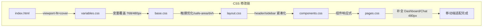

## 用户需求

使当前 796Helper 网站全面支持手机端查看，完善移动端适配。

## 产品概览

796Helper 是一个纯前端 SPA 个人 AI 助手工具，包含仪表盘、AI 聊天、影视搜索三个主要页面。项目已有基础的 768px 断点响应式适配（侧边栏抽屉化、网格单列化等），但存在覆盖不全、小屏体验粗糙、触摸交互不足等问题，需要进行系统性的移动端适配增强。

## 核心功能

1. **完善多断点响应式体系**：补全 480px 小屏断点覆盖（当前仅影视搜索页有 480px 适配，仪表盘和聊天页缺失），优化 768px 断点的各处细节
2. **通用组件移动端适配**：按钮、卡片、输入框、标签等通用组件增加移动端样式调整（当前 components.css 无任何响应式规则）
3. **触摸交互优化**：增大可点击区域（最小 44px 触摸目标）、禁用移动端卡片 hover 上浮效果、优化 -webkit-tap-highlight-color 等移动端特有体验
4. **排版与字体缩放**：在小屏设备上合理缩小标题、正文字体大小，确保信息密度适中且可读性良好
5. **安全区域适配**：支持刘海屏/异形屏的 safe-area-inset 安全区域处理
6. **聊天页键盘适配**：优化移动端虚拟键盘弹出时聊天输入区域的体验，利用 dvh/svh 等视口单位确保输入不被遮挡
7. **Header 紧凑化**：移动端缩小 header 高度、字体，使内容区获得更多可视空间

## 技术栈

- 纯原生 HTML/CSS/JavaScript（与现有项目一致）
- CSS 变量驱动的设计令牌体系
- 无额外框架或库引入

## 实现方案

### 整体策略

基于现有的 CSS 变量体系和媒体查询结构，**通过 CSS 变量覆盖 + 补全媒体查询**的方式实现移动端适配。核心思路是在 `variables.css` 中通过媒体查询动态覆盖设计令牌（字体大小、间距、布局尺寸），让所有使用这些变量的组件自动响应，减少重复代码。对于组件和页面层面的特殊调整，则在各自文件中补充针对性的媒体查询。

### 关键技术决策

1. **CSS 变量层级覆盖（而非硬编码像素值）**：在 `variables.css` 中新增 768px 和 480px 断点的 `:root` 变量覆盖，修改 `--header-height`、`--font-size-*`、`--space-*` 等令牌值。这样所有引用这些变量的组件和页面样式自动适配，避免在每个文件中重复写调整规则。

2. **安全区域使用 `env(safe-area-inset-*)`**：在 `base.css` 中为 body/html 添加 `viewport-fit=cover` 支持，并在 `index.html` 的 viewport meta 中追加 `viewport-fit=cover`。侧边栏、header、聊天输入区等边缘元素需要 padding 补偿安全区域。

3. **视口单位 dvh/svh 优化**：聊天页面使用 `height: 100dvh`（fallback `100vh`）替代固定 `100vh`，解决移动端浏览器地址栏收缩时的高度跳变问题。

4. **触摸优化通过 `@media (hover: none)` 精准控制**：使用 `@media (hover: none)` 检测触摸设备，禁用 hover 上浮动画（`transform: translateY(-4px)` 等），避免在触摸屏上出现粘滞的 hover 态。同时添加 `-webkit-tap-highlight-color: transparent` 和 `touch-action: manipulation` 消除点击高亮和 300ms 延迟。

### 性能考量

- 所有适配均为纯 CSS 修改，零 JavaScript 开销
- 变量覆盖方式避免了大量重复选择器，CSS 体积增量最小
- 不影响现有桌面端样式和交互逻辑

## 实现注意事项

1. **向后兼容**：所有新增媒体查询均附加在现有规则之后，不修改现有的桌面端默认样式，确保桌面端零影响。
2. **dvh 兼容降级**：使用 `height: 100vh; height: 100dvh;` 双行写法，旧浏览器自动忽略 dvh 回退到 vh。
3. **safe-area 降级**：`padding-bottom: env(safe-area-inset-bottom, 0px)` 写法确保无安全区域的设备不受影响。
4. **避免 `!important`**：所有覆盖通过选择器特异性和媒体查询层叠自然覆盖，不使用 `!important`（现有代码中仅 `.hidden` 使用了 `!important`，保持一致）。
5. **保持现有 IIFE 模块模式**：JS 文件仅在 sidebar.js 中做小幅调整（如有必要），不改变架构模式。

## 架构设计

### 修改范围



各层职责清晰：

- `variables.css`：令牌层覆盖（字体/间距/布局尺寸变量在不同断点自动缩放）
- `base.css`：基础层增强（触摸优化全局规则、dvh 视口支持、safe-area 基础）
- `layout.css`：布局层完善（header 紧凑化、sidebar safe-area 处理）
- `components.css`：组件层新增（按钮/卡片/输入框/标签在小屏的适配）
- `pages.css`：页面层补全（Dashboard 和 Chat 的 480px 断点、Chat 键盘适配）

## 目录结构

```
e:\MY Project\796Helper\
├── index.html           # [MODIFY] viewport meta 追加 viewport-fit=cover，支持异形屏安全区域
├── css/
│   ├── variables.css    # [MODIFY] 新增 768px 和 480px 断点的 :root 变量覆盖，动态调整字体大小、间距、header 高度等设计令牌
│   ├── base.css         # [MODIFY] 新增全局触摸优化规则（tap-highlight-color、touch-action）、dvh 视口单位支持、safe-area 基础 padding
│   ├── layout.css       # [MODIFY] 完善 header 移动端紧凑化（高度/字体/间距缩小）、sidebar safe-area 处理、补全 480px 断点
│   ├── components.css   # [MODIFY] 新增 768px 和 480px 响应式媒体查询，适配按钮尺寸/间距、卡片padding/hover禁用、输入框尺寸、标签紧凑化
│   └── pages.css        # [MODIFY] 补全 Dashboard 480px 断点、Chat 480px 断点及键盘适配（dvh+safe-area）、优化聊天输入区 padding
├── js/
│   └── sidebar.js       # [MODIFY] 小幅优化：添加 visualViewport resize 监听（可选），改善虚拟键盘弹出时的体验
└── CHANGELOG.md         # [MODIFY] 新增 v1.4.0 版本记录，记录移动端适配增强的所有变更
```

## Agent Extensions

### SubAgent

- **code-explorer**
- Purpose: 在执行过程中如需精确查找某个 CSS 选择器或 JS 函数的使用情况，使用 code-explorer 进行跨文件搜索
- Expected outcome: 快速定位所有引用点，确保修改的完整性和一致性