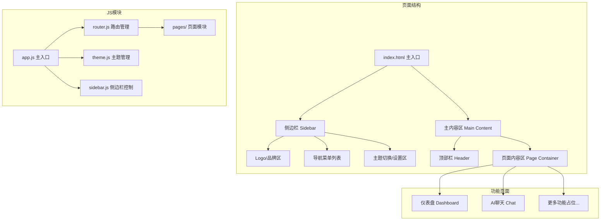

## 用户需求

开发一个网页版个人AI助手"796Helper"，当前阶段需要搭建一个基础的网页框架，为后续集成多种功能模块做好准备。

## 产品概述

796Helper 是一个网页版个人AI助手平台，采用模块化设计，支持通过侧边栏导航在不同功能模块之间切换。核心功能包括AI聊天对话界面，同时预留扩展能力以便后续集成更多工具和功能。

## 核心功能

- **侧边栏导航**：左侧固定导航栏，支持多功能模块的切换，包含折叠/展开能力，显示功能图标和名称
- **主内容区域**：根据侧边栏导航选择，动态切换展示不同功能页面内容
- **AI聊天界面**：作为默认首页和核心功能，包含消息列表展示区、用户输入框、发送按钮，支持消息气泡样式区分用户和AI回复
- **主题切换**：支持深色/浅色两种主题模式，可通过按钮一键切换，主题偏好自动记忆
- **响应式布局**：适配桌面端和移动端不同屏幕尺寸，移动端侧边栏自动收起并可通过按钮呼出
- **欢迎/仪表盘页面**：展示助手概览信息和快捷入口

## 技术栈选择

- **前端框架**：纯原生 HTML5 + CSS3 + JavaScript（ES6+）
- **样式方案**：CSS 自定义属性（CSS Variables）实现主题系统，Flexbox + Grid 实现响应式布局
- **图标库**：Lucide Icons（通过 CDN 引入，轻量且风格现代）
- **字体**：Google Fonts - Poppins（英文）+ 系统默认中文字体
- **无构建工具**：直接打开 HTML 即可运行，零配置，方便快速迭代

### 选型理由

项目为个人工具，当前阶段是搭建基础框架，选择原生技术栈可以：

1. 零依赖、零配置，双击 HTML 即可运行
2. 后续可平滑迁移至 React/Vue 等框架
3. 学习成本低，迭代速度快
4. 文件结构清晰，易于理解和维护

## 实现方案

### 整体策略

采用单页应用（SPA）模式，通过 JavaScript 路由管理实现页面切换，所有功能模块以"页面组件"形式组织。使用 CSS Variables 构建主题系统，通过切换 `data-theme` 属性实现深色/浅色主题。

### 架构设计



### 核心模块说明

1. **路由系统（router.js）**：基于 hash 路由实现页面切换，维护路由表映射，支持动态注册新页面模块
2. **主题系统（theme.js）**：通过 CSS Variables 定义颜色令牌，切换 `document.documentElement.dataset.theme`，使用 localStorage 持久化用户偏好
3. **侧边栏控制（sidebar.js）**：管理侧边栏展开/折叠状态，响应式断点自动切换，移动端遮罩层点击关闭
4. **页面模块（pages/）**：每个功能页面为独立 JS 模块，导出 `render()` 和 `init()` 方法，路由切换时调用

### 数据流

用户点击导航 → hash 变化 → router 匹配路由 → 调用对应页面模块的 render() → 渲染到 Page Container → 调用 init() 绑定事件

## 实现要点

- **CSS Variables 主题**：定义完整的颜色令牌体系（primary、bg、text、border、shadow 等），深色/浅色两套值，切换无闪烁
- **响应式断点**：768px 以下为移动端布局，侧边栏默认隐藏，通过汉堡菜单按钮呼出
- **AI聊天界面**：当前阶段实现静态 UI（消息列表 + 输入框），消息发送为本地模拟，后续接入真实 API
- **模块扩展约定**：新增功能只需在 pages/ 下新建 JS 文件并在路由表注册，侧边栏导航自动关联
- **平滑动画**：侧边栏展开/收起、页面切换、主题切换均添加 CSS transition 过渡效果

## 目录结构

```
e:/MY Project/796Helper/
├── index.html              # [NEW] 主入口HTML文件。定义整体页面骨架结构，包含侧边栏、顶部栏、主内容区的HTML结构。引入所有CSS和JS资源。包含移动端viewport meta标签和字体CDN链接。
├── css/
│   ├── variables.css       # [NEW] CSS变量定义文件。定义深色/浅色两套主题的完整颜色令牌（primary、secondary、bg、surface、text、border、shadow、accent等），以及间距、圆角、过渡时间等全局设计令牌。
│   ├── base.css            # [NEW] 基础样式重置与全局样式。包含CSS Reset、全局盒模型设置、滚动条美化、字体设置、通用工具类（如.hidden, .flex-center等）。
│   ├── layout.css          # [NEW] 布局样式文件。定义侧边栏、顶部栏、主内容区的Flexbox/Grid布局样式，包含响应式媒体查询断点，侧边栏展开/折叠动画，移动端遮罩层样式。
│   ├── components.css      # [NEW] 通用组件样式。定义按钮、输入框、卡片、徽章、头像等可复用UI组件的样式，包含hover/active/focus状态和过渡动画。
│   └── pages.css           # [NEW] 页面专属样式。定义仪表盘页面的卡片网格布局、聊天页面的消息气泡样式（用户/AI区分）、输入区域样式、空状态样式等。
├── js/
│   ├── app.js              # [NEW] 应用主入口。负责初始化路由、主题、侧边栏等核心模块，监听DOMContentLoaded事件启动应用，协调各模块初始化顺序。
│   ├── router.js           # [NEW] 路由管理模块。基于hash路由实现SPA页面切换，维护路由注册表，监听hashchange事件，调用对应页面模块的render和init方法，处理404页面。
│   ├── theme.js            # [NEW] 主题管理模块。实现深色/浅色主题切换逻辑，读取/写入localStorage持久化偏好，监听系统主题偏好变化（prefers-color-scheme），提供切换动画。
│   ├── sidebar.js          # [NEW] 侧边栏控制模块。管理侧边栏展开/折叠/移动端显示隐藏，处理导航项高亮状态联动路由，响应窗口resize事件自动调整布局。
│   └── pages/
│       ├── dashboard.js    # [NEW] 仪表盘页面模块。渲染欢迎信息、功能快捷入口卡片、系统状态概览，导出render()和init()方法供路由调用。
│       └── chat.js         # [NEW] AI聊天页面模块。渲染聊天消息列表、用户输入区域，实现本地模拟消息发送/接收、消息气泡渲染、自动滚动到底部、空状态提示等交互。
├── CHANGELOG.md            # [NEW] 更新日志文件。记录项目每次功能迭代的版本号、日期和变更内容，采用 Keep a Changelog 格式规范，后续每次功能迭代在此追加日志。
└── assets/
    └── favicon.svg         # [NEW] 网站图标。简洁的SVG格式图标，呈现796Helper品牌标识。
```

## 设计风格

采用现代化 Glassmorphism（玻璃态）与 Minimalism（极简主义）相结合的设计风格，营造高级、专业且富有科技感的视觉体验。整体界面以深色模式为默认主题，搭配半透明磨砂玻璃质感面板、柔和渐变和精致的微动画，打造沉浸式AI助手使用体验。

## 页面规划

### 页面一：AI聊天页面（默认首页）

- **顶部栏**：左侧汉堡菜单按钮（移动端）+ 当前页面标题"AI 助手"，右侧显示主题切换按钮（太阳/月亮图标动画切换）和用户头像
- **消息展示区**：占据主体空间，消息以气泡形式展示。AI消息靠左，带AI头像图标和半透明玻璃背景；用户消息靠右，使用主色调渐变背景。消息间有适当间距，新消息自动滚动到视图底部
- **欢迎状态**：无消息时显示居中的大图标 + "你好，我是796Helper" 欢迎语 + 功能提示标签云
- **输入区域**：底部固定，圆角输入框搭配渐变发送按钮，输入框获得焦点时有发光边框效果。支持 Shift+Enter 换行，Enter 发送

### 页面二：仪表盘页面

- **顶部栏**：与聊天页面一致的布局风格
- **欢迎区域**：大字号问候语"你好，欢迎回来"，配合当前日期时间和渐变文字效果
- **功能卡片网格**：2列网格布局展示功能入口卡片。每张卡片包含图标、功能名称和简短描述，hover时有上浮阴影和边框发光效果。卡片包括：AI聊天、待办事项（即将推出）、笔记（即将推出）、设置（即将推出）
- **底部状态栏**：显示"796Helper v1.0"版本信息

### 侧边栏（全局）

- **品牌区域**：顶部显示应用Logo图标和"796Helper"名称，折叠态仅显示图标
- **导航列表**：各功能入口以图标+文字形式排列，当前页面项带有主色调左侧指示条和背景高亮，hover有平滑过渡效果
- **底部区域**：侧边栏折叠按钮和主题切换快捷入口
- **移动端**：从左侧滑入，带有半透明深色遮罩背景，点击遮罩或导航项自动关闭

## 交互动效

- 侧边栏展开/收起：宽度平滑过渡（0.3s ease）
- 页面切换：内容区域淡入效果（fadeIn 0.3s）
- 主题切换：颜色属性统一过渡（0.3s），图标旋转动画
- 按钮交互：hover上浮 + 阴影扩散，active下沉微缩
- 消息气泡：新消息出现时从底部滑入并淡入（slideUp 0.3s）
- 卡片交互：hover时 translateY(-4px) + box-shadow增强 + border发光

## 响应式设计

- 桌面端（大于768px）：侧边栏固定展示（240px宽），主内容区自适应剩余空间
- 移动端（768px及以下）：侧边栏隐藏，通过顶部栏汉堡按钮呼出，主内容区占满全屏宽度