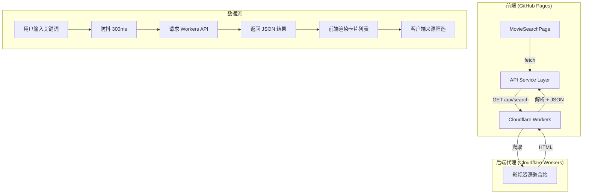

## 用户需求

新增一个影视资源搜索功能页面，可通过爬虫获取影视资源，支持按影视名称搜索，同时支持按资源来源类型进行筛选。

## 产品概述

在 796Helper 应用中新增"影视搜索"页面，用户输入影视名称后，系统通过后端代理服务（Cloudflare Workers）爬取多个网盘资源站点，返回匹配的影视资源列表。用户可通过来源类型标签（百度网盘、夸克网盘、迅雷网盘等）快速筛选结果。

## 核心功能

1. **影视名称搜索**：提供搜索输入框，用户输入影视名称后发起搜索，展示匹配的资源列表
2. **资源来源类型筛选**：搜索结果支持按来源类型标签筛选，包括"全部"、"百度网盘"、"夸克网盘"、"迅雷网盘"等
3. **搜索结果展示**：以卡片列表形式展示每条资源，包含资源名称、来源平台标识、资源链接/提取码、发布时间等信息
4. **搜索状态反馈**：包含加载动画、空结果提示、错误提示等完整状态
5. **Cloudflare Workers 代理服务**：搭建后端代理转发爬虫请求，解决前端跨域限制，爬取公开的影视网盘资源聚合站数据
6. **侧边栏与仪表盘联动**：侧边栏新增"影视搜索"导航项，仪表盘功能卡片增加影视搜索入口

## 技术栈

- **前端**：原生 JavaScript（IIFE 模块模式），遵循现有项目架构
- **后端代理**：Cloudflare Workers（Serverless，免费额度足够个人使用）
- **图标**：Lucide Icons（项目已集成 CDN）
- **样式**：CSS Variables + Glassmorphism 风格，遵循现有设计令牌系统

## 实现方案

### 整体策略

前端新增 `MovieSearchPage` 页面模块，遵循现有 IIFE 模块模式（暴露 `{ title, render, init }`），通过 `fetch` 请求 Cloudflare Workers 代理服务。Workers 接收搜索关键词，爬取公开的影视资源聚合站（如网盘资源搜索站），解析 HTML 提取资源信息后以 JSON 返回前端。

### 关键技术决策

1. **爬虫目标站点选择**：使用公开的网盘资源聚合搜索站（如 UP云搜、小纸条等类似站点）作为数据源。这些站点本身聚合了百度网盘、夸克网盘、迅雷网盘等来源，通过 Workers 代理请求并解析其搜索结果页面 HTML，提取资源名称、来源类型、链接和提取码。

2. **Cloudflare Workers 架构**：Workers 作为无服务器代理，接收前端 `GET /api/search?keyword=xxx&source=xxx` 请求，向目标站发起搜索请求，使用正则或字符串方法解析 HTML（Workers 环境无 DOM API），返回结构化 JSON。设置 CORS 头允许 GitHub Pages 域名访问。

3. **资源来源筛选实现**：Workers 返回全部搜索结果（每条包含 `source` 字段标识来源类型），前端在内存中按 `source` 字段进行客户端筛选，避免重复请求。筛选标签使用 tag 组件样式，与项目现有 `.tag` 组件一致。

4. **搜索防抖**：用户输入时采用 300ms 防抖，避免频繁请求。同时支持 Enter 键和点击按钮触发搜索。

### 性能与可靠性

- Workers 免费额度：每日 10 万次请求，个人使用完全充足
- 搜索结果分页：初期展示前 20 条结果，后续可扩展分页
- 错误处理：网络超时、目标站不可用、无结果等场景均有对应 UI 状态
- Workers 响应缓存：对相同关键词的请求缓存 5 分钟，减少重复爬取

## 实现细节

### 前端页面模块（MovieSearchPage）

- 遵循现有 IIFE 模块模式，与 `ChatPage`、`DashboardPage` 风格一致
- 搜索输入区复用现有 `.input` 组件样式，筛选标签复用 `.tag` 组件
- 结果卡片使用 `.card` 玻璃态样式，每条资源卡片展示：资源名称、来源平台 badge、链接（可点击复制）、提取码
- 加载状态使用现有 `.loading-dots` 动画
- 空状态和错误状态展示友好提示图标和文案

### Cloudflare Workers 代理

- 入口 `worker/index.js`，部署后获得 `xxx.workers.dev` 域名
- 路由：`GET /api/search?keyword=关键词&source=来源类型(可选)`
- 设置 `Access-Control-Allow-Origin` 允许 `https://clark-gustarve.github.io`
- HTML 解析使用正则提取关键字段（Workers 环境无 cheerio/DOM，保持轻量）
- 错误降级：目标站不可用时返回 `{ error: "服务暂时不可用" }`

### 路由与导航集成

- `Router.register('movie-search', MovieSearchPage)` 注册新路由
- 侧边栏"工具"分区添加"影视搜索"导航项，使用 `film` 图标，无"即将推出"标签
- 仪表盘新增影视搜索功能卡片，状态为"可用"，点击跳转到搜索页

## 架构设计



## 目录结构

```
e:\MY Project\796Helper\
├── index.html                    # [MODIFY] 侧边栏添加"影视搜索"导航项（工具分区，film图标）；<script> 区添加 movie-search.js 引入
├── js/
│   ├── app.js                    # [MODIFY] 添加 Router.register('movie-search', MovieSearchPage)，版本号更新
│   └── pages/
│       └── movie-search.js       # [NEW] 影视搜索页面模块。IIFE 模式，暴露 { title, render, init }。
│                                 #   - render(): 搜索输入区（输入框+搜索按钮）、来源筛选标签栏（全部/百度网盘/夸克网盘/迅雷网盘）、
│                                 #     搜索结果卡片列表区、空状态/加载态/错误态展示
│                                 #   - init(): 搜索按钮点击事件、Enter键搜索、输入防抖、标签筛选切换、
│                                 #     链接复制功能、与 Workers API 的 fetch 通信
│                                 #   - API 配置：Workers 代理地址常量，便于后续切换
├── css/
│   └── pages.css                 # [MODIFY] 新增影视搜索页面专属样式：搜索区布局、筛选标签栏、
│                                 #   结果卡片列表（来源badge配色、链接复制按钮）、空状态/加载态/错误态、
│                                 #   移动端响应式适配（768px断点）
├── worker/
│   ├── index.js                  # [NEW] Cloudflare Workers 入口。处理 /api/search 路由，
│                                 #   接收 keyword/source 参数，爬取目标资源站搜索页，
│                                 #   正则解析 HTML 提取资源名称/来源/链接/提取码，
│                                 #   返回 JSON，设置 CORS 头，5分钟缓存，错误降级处理
│   ├── wrangler.toml             # [NEW] Cloudflare Workers 配置文件。定义 worker 名称、
│                                 #   兼容性日期、路由配置
│   └── README.md                 # [NEW] Workers 部署说明文档。包含注册 Cloudflare 账号、
│                                 #   安装 wrangler CLI、部署命令、环境变量配置等步骤
├── CHANGELOG.md                  # [MODIFY] 记录 v1.1.0 版本更新日志，包含影视搜索功能说明
└── js/pages/
    └── dashboard.js              # [MODIFY] 功能卡片网格新增"影视搜索"卡片，
                                  #   使用 film 图标、蓝紫渐变背景、badge 标注"可用"，
                                  #   点击跳转 #movie-search
```

## 关键代码结构

```typescript
// Workers API 返回的资源数据结构
interface MovieResource {
    title: string;        // 资源名称，如"流浪地球2 4K"
    source: string;       // 来源类型："baidu" | "quark" | "thunder" | "other"
    sourceLabel: string;  // 来源显示名："百度网盘" | "夸克网盘" | "迅雷网盘"
    link: string;         // 资源链接
    code: string;         // 提取码（可为空）
    time: string;         // 发布时间
}

// Workers API 响应结构
interface SearchResponse {
    success: boolean;
    data: MovieResource[];
    total: number;
    keyword: string;
    error?: string;
}
```

## 设计风格

延续 796Helper 现有的 Glassmorphism 玻璃态设计风格，深浅双主题适配。影视搜索页面整体布局分为搜索区域、筛选区域和结果区域三个层级，视觉上从上到下形成清晰的操作流。

## 页面设计

### 影视搜索页（movie-search）

#### 区块一：搜索区域

顶部居中的搜索栏，包含一个带有搜索图标（search）的输入框和一个渐变色搜索按钮。输入框使用玻璃态背景，聚焦时展现紫色光晕边框。搜索按钮使用主色渐变。整体最大宽度 680px 居中布局。

#### 区块二：来源筛选标签栏

搜索栏下方的水平标签栏，包含"全部"、"百度网盘"、"夸克网盘"、"迅雷网盘"等标签按钮。采用现有 tag 组件样式，选中状态使用主色背景高亮。标签栏水平居中，flex-wrap 适配移动端换行。

#### 区块三：搜索结果列表

以垂直卡片列表展示搜索结果，每张卡片为玻璃态背景，包含：左侧 film 图标区域、中间资源名称和发布时间、右侧来源 badge（不同来源不同配色：百度蓝、夸克紫、迅雷橙）和复制链接按钮。卡片 hover 时上浮并显示光晕阴影。列表区域可滚动，最大宽度 800px 居中。

#### 区块四：状态展示

- 初始态：居中展示 film 图标 + "搜索你想看的影视资源" 引导文案 + 热门搜索标签
- 加载态：居中三点加载动画 + "正在搜索..." 文案
- 空结果态：居中 search-x 图标 + "未找到相关资源" 提示
- 错误态：居中 alert-circle 图标 + 错误信息 + 重试按钮

## 响应式设计

- 桌面端：搜索栏和结果区域居中，卡片内横向排列信息
- 移动端（<=768px）：搜索栏全宽，筛选标签换行，卡片信息纵向堆叠

## Agent Extensions

### SubAgent

- **code-explorer**
- Purpose: 在实现过程中探索项目文件结构和现有代码模式，确保新增代码与现有架构一致
- Expected outcome: 精确定位需要修改的代码位置，确认现有组件样式和模块接口规范