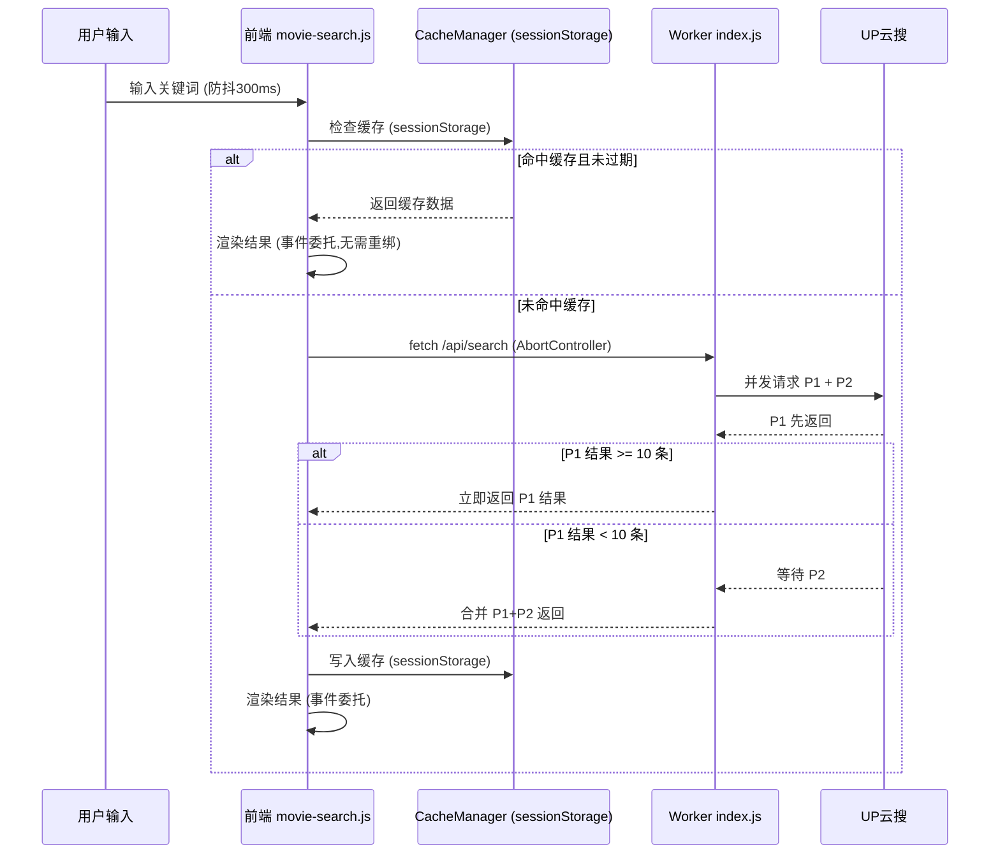
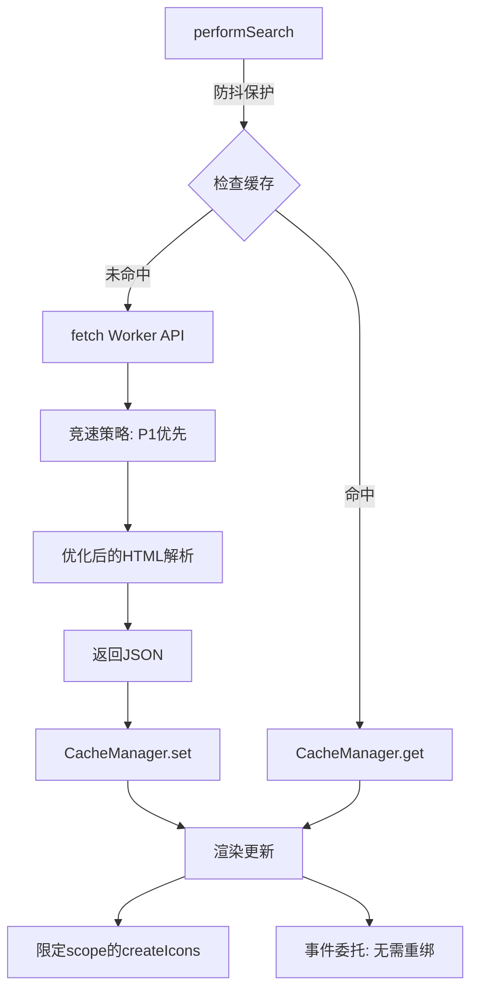

## 用户需求

优化当前项目中影视资源搜索功能的搜索速度。

## 产品概述

796Helper 是一个纯前端 SPA 个人助手工具集，其中影视资源搜索功能通过 Cloudflare Workers 代理爬取 UP云搜，完成搜索并在前端展示结果。当前搜索链路为：前端输入关键词 -> fetch Worker API -> Worker 并发爬取 UP云搜 2 页 HTML -> 正则解析 -> 返回 JSON -> 前端全量渲染。需要从前端交互响应、Worker 请求效率、HTML 解析性能、缓存策略、渲染性能五个层面进行全链路提速。

## 核心功能

1. **前端搜索防抖与交互优化**：添加输入防抖避免重复请求，搜索按钮 Loading 态反馈，Loading 时显示实时耗时计时器
2. **Worker 端请求竞速策略**：将 P1/P2 从等待全部完成（Promise.all）改为竞速优先返回（Promise.allSettled + 流式合并），P1 先到即可展示，P2 结果补充追加
3. **Worker 端 HTML 解析性能优化**：优化正则表达式减少回溯，预编译复用正则对象，提前截断无关 HTML 内容减少扫描范围
4. **前端持久化缓存**：将搜索缓存从内存 Map 升级为 sessionStorage 持久化，页面刷新不丢失缓存，同时保留 TTL 和容量限制
5. **前端渲染性能优化**：使用 DocumentFragment 批量插入 DOM，限定 lucide.createIcons 的扫描范围（传入容器节点），筛选切换时使用事件委托避免重复绑定事件

## 技术栈

- 前端：原生 HTML/CSS/JavaScript（无框架依赖），IIFE 闭包模块模式
- 后端代理：Cloudflare Workers（ES Modules 格式）
- 部署：GitHub Pages（前端）+ Cloudflare Workers（后端）
- 无构建工具，所有代码直接浏览器运行

## 实现方案

整体策略是对搜索全链路（输入 -> 网络请求 -> 数据解析 -> 缓存 -> 渲染）进行逐层优化，在不改变架构模式和用户体验设计的前提下，大幅提升搜索响应速度和感知速度。

### 关键技术决策

**1. 前端防抖 + 搜索按钮状态锁（movie-search.js）**

当前问题：无输入防抖，快速敲 Enter 会触发多次 performSearch。搜索源切换时若已有关键词也会立即触发搜索，无节流。

方案：在 IIFE 内部新增 `debounce` 工具函数（300ms），应用于 Enter 键触发和搜索源切换的自动重搜。搜索按钮点击保持即时触发（无防抖）。搜索进行中锁定搜索按钮，防止重复点击。Loading 态新增实时耗时计时器（setInterval 每秒更新），增强用户感知。

**2. Worker 端竞速优先返回策略（worker/index.js）**

当前问题：`Promise.all` 等待 P1 和 P2 全部完成后才返回，若 P2 较慢会拖累整体响应。实际 P1 通常已包含最相关的结果。

方案：改用 `Promise.allSettled` 配合早期返回逻辑 —— 如果 P1 先完成且结果 >= 10 条，不等待 P2 直接返回；如果 P1 结果较少则等待 P2 补充。这样对大多数搜索场景可节省 2-5 秒（P2 的请求+解析时间）。保留 P2 作为可选补充而非必须项。

**3. Worker 端 HTML 解析优化（worker/index.js）**

当前问题：

- `parseUpyunsoResults` 中先全量扫描 `timePattern` 收集时间戳，再全量扫描 `anchorPattern` 匹配标题，两次全文正则扫描
- 备用模式中 `html.replace(/<[^>]+>/g, '\n')` 对整个 HTML 做全文标签剥离，性能开销大
- `detectSource` 每次遍历 SOURCE_MAP 全部键值对

方案：

- 预编译正则为模块级常量，避免每次函数调用重新创建
- 截取 HTML 中 `<body>` 到 `</body>` 之间的内容再做解析，减少 60%+ 的扫描范围（去掉 head/script/style）
- `detectSource` 改为基于关键词长度降序匹配（长关键词优先），并在匹配到后立即返回，减少不必要的 `includes` 调用
- 移除 `parseSearchResults`（通用解析函数），当前只有 UP云搜 一个源，这段死代码不执行但增加文件体积

**4. 前端缓存升级为 sessionStorage（movie-search.js）**

当前问题：`searchCache = new Map()` 在页面刷新后丢失，用户刷新页面后同一关键词需重新请求。

方案：将缓存读写封装为 `CacheManager` 内部对象，底层使用 `sessionStorage`（key 前缀 `796h-mc-`），JSON 序列化存取。保留 5 分钟 TTL 和 20 条容量限制。启动时从 sessionStorage 恢复已有缓存条目。sessionStorage 随标签页关闭自动清理，无需手动过期清除。降级处理：若 sessionStorage 不可用（隐私模式等），回退到内存 Map。

**5. 前端渲染性能优化（movie-search.js）**

当前问题：

- `updateContent()` 每次全量 `innerHTML` 重写整个内容区
- `lucide.createIcons()` 无参调用，扫描整个 document
- `bindDynamicEvents()` 每次用 `querySelectorAll` 遍历绑定，筛选切换时会重复绑定

方案：

- `lucide.createIcons()` 改为传入 `{ nameAttr: 'data-lucide', icons: {}, attrs: {} }` 并限定容器作用域。参考 Lucide API：`lucide.createIcons({ attrs: {}, nameAttr: 'data-lucide' })` 无法限定容器，改为手动在容器内 `querySelectorAll('[data-lucide]')` 后调用 `lucide.createElement`，或者在全局调用后不做变更。经确认 lucide UMD 版本的 `createIcons` 不支持容器参数，但支持 `{ attrs }` 配置。优化方案改为：只在内容区真正变化时才调用 `createIcons`，避免筛选切换时的冗余调用（筛选切换只更新列表和标签，图标类型不变）
- 事件委托：将复制按钮、筛选标签、重试按钮的事件绑定改为在 `movieContentArea` 和 `movieFilterBar` 上使用事件委托（一次绑定，永久生效），完全消除 `bindDynamicEvents` 的重复绑定开销
- 筛选切换时只更新结果列表区域（`.movie-results-list`）和筛选标签栏，不重写整个内容区

## 实现注意事项

### 性能关键路径

- Worker 端的主要瓶颈是上游 HTTP 请求延迟（UP云搜响应时间），解析优化是次要收益（毫秒级），竞速策略是主要收益（秒级）
- 前端主要感知瓶颈是等待 API 响应期间的空白感，实时计时器可显著改善用户心理预期
- `lucide.createIcons()` 全局扫描在结果多时有可感知的卡顿（30张卡片 x 3-4个图标 = 90-120个 SVG 渲染）

### 向后兼容

- 所有优化不改变 API 接口格式、HTML 结构、CSS 类名
- IIFE 模块暴露的 `{ title, render, init }` 接口不变
- sessionStorage 缓存与内存 Map 缓存的数据结构保持一致，仅存储层变化
- Worker 的请求/响应 JSON 格式不变

### 爆炸半径控制

- 不修改 router.js、theme.js、sidebar.js、app.js 等无关模块
- 不修改 CSS 样式文件（无视觉变化）
- Worker 端优化保持相同的 API 端点和响应格式

## 架构设计

### 优化后的搜索数据流



### 模块内部优化架构



## 目录结构

```
796Helper/
├── js/
│   └── pages/
│       └── movie-search.js       # [MODIFY] 前端搜索模块全面优化：
│                                  #   - 新增 debounce 防抖函数（300ms），应用于 Enter 键和搜索源切换
│                                  #   - 新增 CacheManager 对象封装 sessionStorage 缓存读写
│                                  #     （get/set/clear，自动 TTL 过期检查，容量限制20条，降级内存 Map）
│                                  #   - performSearch 增加搜索按钮 Loading 状态锁
│                                  #   - Loading 态增加实时耗时计时器（setInterval 每秒更新 DOM 文本）
│                                  #   - 事件委托重构：init() 中在 movieContentArea 和 movieFilterBar 
│                                  #     上绑定 click 委托，通过 closest() 判断目标元素
│                                  #   - 移除 bindDynamicEvents 函数，改为 handleContentClick/handleFilterClick
│                                  #   - updateContent 中筛选切换路径只更新 .movie-results-list 内容
│                                  #   - lucide.createIcons() 仅在 innerHTML 实际变化时调用
├── worker/
│   └── index.js                  # [MODIFY] Worker 端搜索性能优化：
│                                  #   - 竞速策略：P1 结果 >= 10 条时不等 P2 直接返回
│                                  #   - 预编译正则常量移至模块顶层
│                                  #   - parseUpyunsoResults 增加 HTML body 截取，减少扫描范围
│                                  #   - 移除未使用的 parseSearchResults 死代码函数
│                                  #   - detectSource 优化为按关键词长度降序匹配
├── CHANGELOG.md                  # [MODIFY] 新增 v1.3.0 版本记录
└── [技术文档]                     # [MODIFY] 更新性能优化章节，补充 v1.3.0 变更
```

## Agent Extensions

### SubAgent

- **code-explorer**
- 用途：在实施各优化步骤前，确认 lucide CDN 版本 createIcons API 的确切参数支持，验证 sessionStorage 在 GitHub Pages 上的可用性，以及确认 Worker 中 Promise.allSettled 的兼容性
- 预期结果：确保所有 API 调用方式准确无误，避免运行时错误